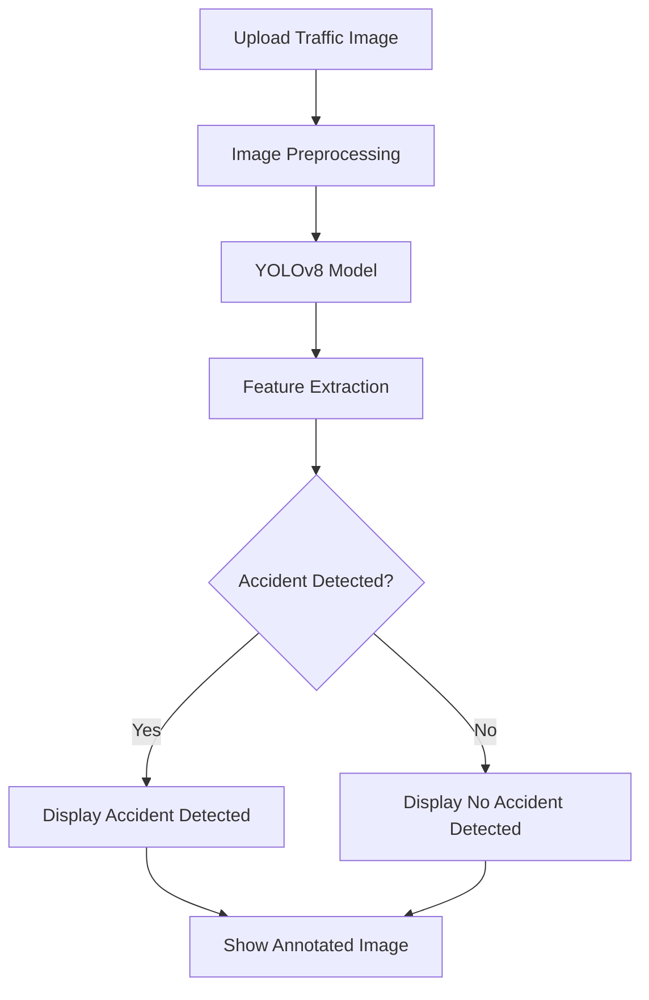
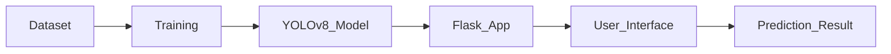

# 🚨 Traffic Accident Detection System

An AI-powered web application that detects road accidents from traffic images using YOLOv8 and Computer Vision techniques.

## 🔄 System Workflow



## 🛠️ Tech Stack

- Python
- Flask
- YOLOv8
- OpenCV
- HTML
- CSS

## ✨ Features

- AI-based accident detection
- Traffic image analysis
- Real-time prediction
- User-friendly web interface
- Annotated accident detection results

## 🚀 Project Flow



## ▶️ Run Project

```bash
python app.py
```

## 👨‍💻 Authors

- Pavithra Prem
- Neelima B
- Renjima Rajeev
- Vinitha PJ

